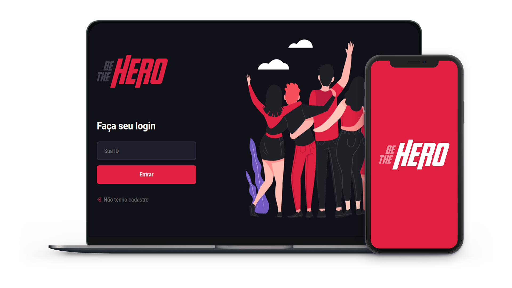

<h1 align="center">
    
</h1>

<h2 align="center">
    
</h2>

<h2 align="center">
  
  🚀 Semana Omnistack 11
</h2>

  <a href="#rocket-tecnologias">Tecnologias</a> | 
  <a href="#-projeto">Projeto</a> | 
  <a href="#-----semana-omnistack-11">Layout</a> | 
  <a href="#-como-contribuir">Como contribuir</a> | 
  <a href="#memo-licença">Licença</a>

## :rocket: Tecnologias
Principais tecnologias usadas no projeto:

- [Node.js](https://nodejs.org/en/)
- [ReactJS](https://reactjs.org)
- [React Native](https://reactnative.dev/)
- [Expo](https://expo.io/)

## 💻 Projeto

Be the Hero é um projeto feito pela Rocketseat que tem a intenção de ajudar, de maneira **financeira** às instituições.
 
O projeto foi desenvolvido como forma de aprendizado na semana OmniStack 11.
 
A versão Web possui dark mode.

## 🤔 Como contribuir

- Faça um fork desse repositório;
- Cria uma branch com a sua feature: `git checkout -b minha-feature`;
- Faça commit das suas alterações: `git commit -m 'feat: Minha nova feature'`;
- Faça push para a sua branch: `git push origin minha-feature`.

Depois que o merge da sua pull request for feito, você pode deletar a sua branch.

## :memo: Licença

Esse projeto está sob a licença MIT. Veja o arquivo [LICENSE](LICENSE) para mais detalhes.

---

Feito com ❤️ by **Rocketseat/rodrigocelvo**
